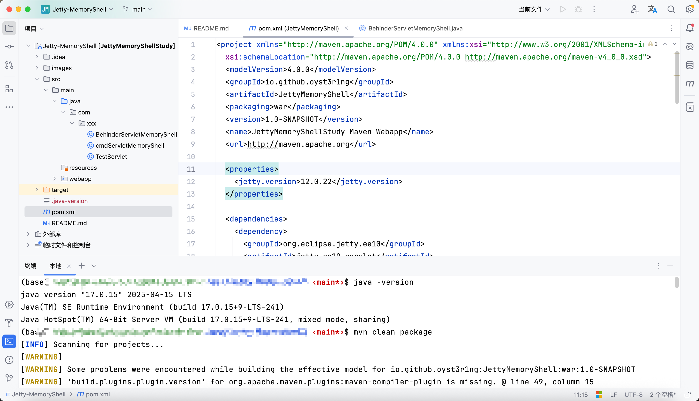
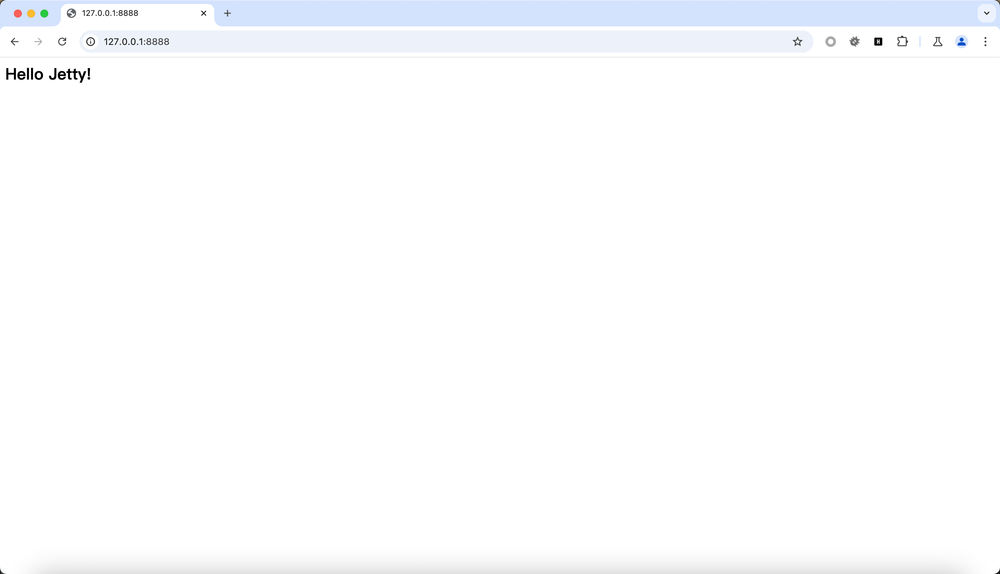
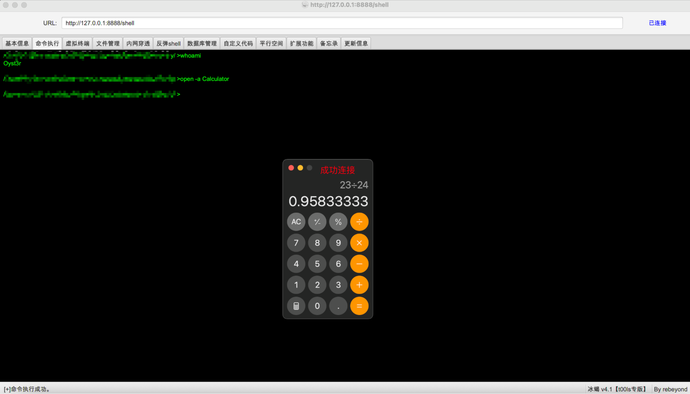

# Jetty-MemoryShell

## 介绍

本项目演示了在 JDK 17 与 Jetty 12 等高版本环境下，通过动态注入的方式加载内存马的实现方法（目前仅包含 Servlet 型内存马）。其中：

- TestServlet 类：用于验证运行环境是否正常。
- cmdServletMemoryShell 类：实现命令执行并回显结果的内存马；
- BehinderServletMemoryShell 类：可直接对接冰蝎客户端进行管理和上线。

## 使用方式

1. 打包编译。命令行运行 mvn clean package，如下-->

2. 启动 Jetty（插件方式）。运行 mvn jetty:run，启动 Jetty 服务器。

3. 注入内存马。访问 /inject 注入冰蝎内存马至 /shell，用客户端连接成功，如下-->

